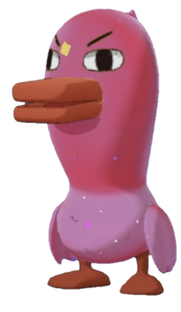

# DrawAnythingToYakiji

A creative drawing web app that turns anything you draw into adorable **Yakiji** (duck/chick mascot) illustrations through particle morphing animation.

**Try it live:** [DrawAnythingToYakiji](https://tsanghaotian.github.io/DrawAnythingToYakiji/)



## How It Works

1. **Draw** anything on the canvas using mouse or touch
2. **Pause** for 1 second — the strokes are automatically detected
3. **Watch** as your drawing transforms into a Yakiji illustration through a particle-by-particle morphing animation
4. **Continue** drawing — each new stroke morphs into a different Yakiji image
5. **Clear** with the button to start fresh

## Features

- **Particle morphing** — each stroke dissolves into hundreds of colored particles that reassemble into the target image
- **Smart orientation** — stroke angle is analyzed via PCA (Principal Component Analysis) to auto-rotate the target image to match your drawing direction
- **12 unique Yakiji illustrations** — each stroke picks the next image in sequence
- **Mobile-friendly** — full touch support with responsive canvas
- **Zero dependencies** — pure HTML, CSS, and JavaScript, no libraries or frameworks

## Tech

- Vanilla JavaScript canvas rendering
- `requestAnimationFrame` animation loop with easing functions
- Principal Component Analysis (PCA) for stroke angle detection
- Pixel sampling for particle color data from source images
- `file://` protocol safe — fallback grid sampling when CORS restrictions apply

## Project Structure

```
├── index.html          # Main application (single HTML file)
├── img/                # 12 Yakiji illustration PNGs
│   ├── 1.png
│   ├── 2.png
│   └── ... up to 12.png
├── .github/workflows/  # GitHub Pages deployment
└── README.md
```

## Credits

Created by [TsangHaotian](https://github.com/TsangHaotian)
